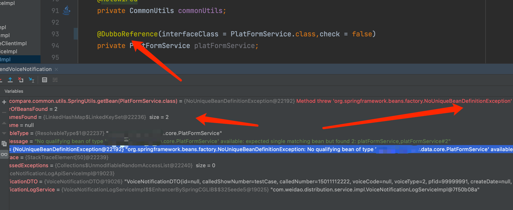
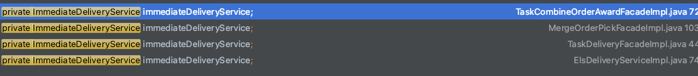
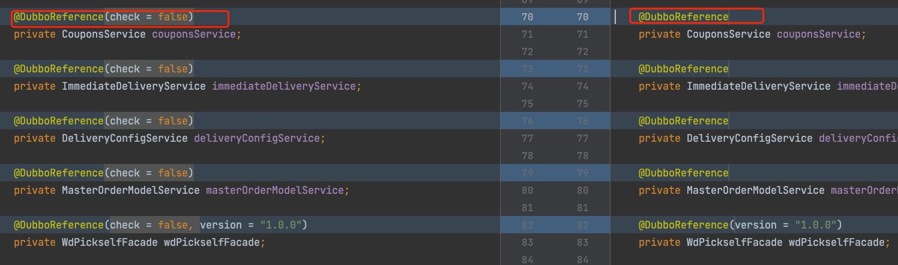

# 现象
如下图，当从spring容器取出制定注入的dubbo provider时，发生异常，经过排查发现spring中被注入了2份。

  

    
  

# 原因
如下图，有较多类声明了同一个dubbo bean，而声明的方式也不同，导致被注入两次。由于是老项目，没有对dubbo bean进行收敛和proxy封装。

  

    
  

# 解决
所有引用的地方改成一致的声明方式即可。

  

    
  

